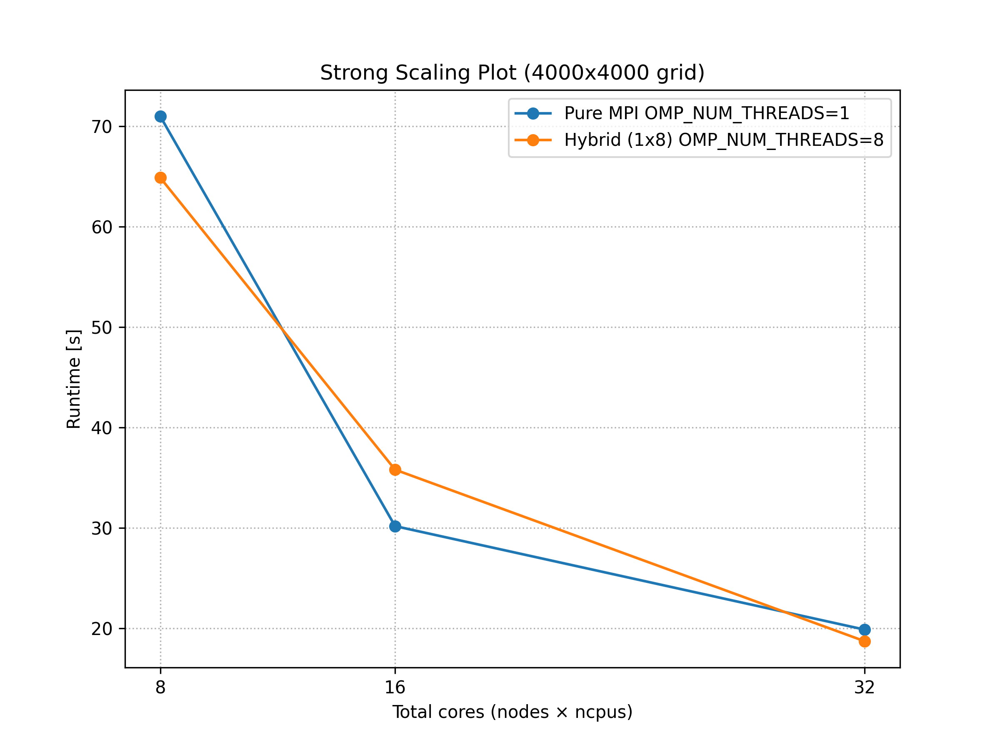
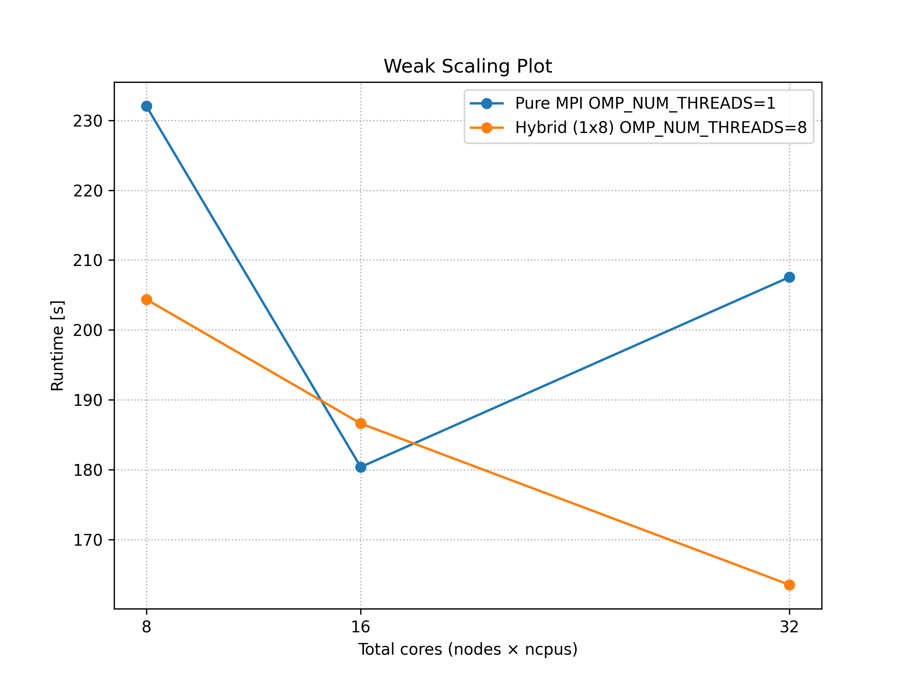

# PVL for HPC Course

The problem is a disease spread model called as SIR:
- Susceptible (Healthy): Can be infected.
- Infected: Can infect other cells and will become healthy after certain time.
- Recovered (Immune): Temporarily immune after recovering from infection.

We have to simulate a probabilistic model with following rules for state changes: 

1. Infection: A healthy cell adjacent to an infected cell becomes infected with a probability $p$ in the next time step.
2. Recovery: An infected cell has a probability $q$ to become healthy in the next time step.
3. Immunity: Once a cell recovers, it becomes immune for $t$ time steps. After this immunitiy period, the cell becomes susecptible again. 

Simulation runs for a predefined number of time steps or until a steady state is reached. Initially, a few cells are randomly marked infected to start disease spread. 

In my opinion, it is more like a cellular automata problem. 

## Steps for the project: 

1. Try $p = 0.5, q = 0.3, t = 5$ and start with 5 initial infections at random cells. 
2. First, a Python code to implement the problem and get a quick understanding. This code will be sequential. 
3. Translate Python code to C++, but again sequential in nature. Check if the implementation is correct and add visualization. 
4. Select a grid size such that the sequential run time is between 100s to 400s. 
5. Perform hybrid MPI/OpenMP parallelization:
    - First MPI implementation: distribute the grid in horizontal (bunch of rows) patches between MPI ranks. 
    - For all for loops that will be computed within the MPI ranks, apply OpenMP. 
    - Keep both versions separately for comparison: only MPI and hybrid.
6. Perform strong and weak scalability tests. 

### A glimpse of the simulation results


1000x1000 grid starting with 5 random cells being infected and how the infection spreads over 1000 steps. Yellow: recovered (2), green: infected (1), purple: susceptible (0).


### Scaling

Ref. sequential time for 4000x4000 grid with 1000 steps: 708.891 s.

#### Strong scaling
The problem size: 4000x4000 grid with 1000 steps. MPI Only and hybrid. For hybrid ```OMP_NUM_THREADS=8``` for the same cases as that of MPI Only. 




| run | nodes | ncpus | mpiprocs| total cores | OMP_NUM_THREADS | grid size | time (s) |
| --- | --- | --- | --- | --- | --- |--- | --- |
| Hybrid |
| H1 | 1 | 8 | 8 | 8  | 8 | 4000x4000 | 64.868 |
| H2 | 2 | 8 | 8 | 16 | 8 | 4000x4000 | 35.788 |
| H3 | 4 | 8 | 8 | 32 | 8 | 4000x4000 | 18.701 |
|MPI_Only | 
| M1 | 1 | 8 | 8 | 8  | 1 | 4000x4000 | 70.981 |
| M2 | 2 | 8 | 8 | 16 | 1 | 4000x4000 | 30.167 |
| M3 | 4 | 8 | 8 | 32 | 1 | 4000x4000 | 19.856 |


#### Weak scaling
The problem size is increase proportionally as the cores are increased. It is attempted to ensure that the per rank core grid remains 1000x1000 (e.g. H3: $\sqrt32*1000 = 5657$). For hybrid ```OMP_NUM_THREADS=8``` for the same cases as that of MPI Only. 



| run | nodes | ncpus | mpiprocs| total cores | OMP_NUM_THREADS | grid size | time (s) |
| --- | --- | --- | --- | --- | --- |--- | --- |
| Hybrid |
| H1 | 1 | 8 | 1 | 8  | 8 | 2828x2828 | 204.384 |
| H2 | 2 | 8 | 1 | 16 | 8 | 4000x4000 | 186.613 |
| H3 | 4 | 8 | 1 | 32 | 8 | 5657x5657 | 163.526 |
|MPI_Only | 
| M1 | 1 | 8 | 1 | 8  | 1 | 2828x2828 | 232.051 |
| M2 | 2 | 8 | 1 | 16 | 1 | 4000x4000 | 180.383 |
| M3 | 4 | 8 | 1 | 32 | 1 | 5657x5657 | 207.569 |


### Overview Pseudocode

1. Initialize Program
    - Setup MPI environment
    - Define simulation parameters
    - Setup random number generation

2. Setup Grid
    - Calculate distribution across ranks [Logic](#calculate-row-distribution-among-ranks)
    - Create local rank grids
    - Rank 0 and random number generator decide first 5 infection positions
    - Broadcast the positions to all ranks
    - Infect corresponding infected cells in local ranks

3. Main Simulation Loop
    - Gather current state for output (only if storing output on)
    - Exchange ghost rows with neighbors [Logic](#exchange-the-ghost-rows-before-update)
    - Process local grid section
      - Thread-safe random number generator with unique seed
      - Handle infections
      - Process recoveries
      - Update immunity timers
    - Share boundary infections [Logic](#update-ghost-rows-from-neighboring-local-grids)
    - Update for next iteration

4. Finalize
    - Save final output
    - Cleanup MPI

#### Calculate row distribution among ranks


In this diagram:
- The original 10×10 grid is divided horizontally among 4 ranks
- Each process gets ```int(10/2) = 2``` rows (plus 1 row distributed to all ranks with index less than 2)
- Each process owns a local section (some rows) of the complete grid
- The number of elements (```sendcounts```) and the row-start positions (```displs```) are also computed
- Using ```MPI_Scatterv```, the complete grid is distributed among all ranks

Pseudocode section: [pesudocode](#grid-distribution)

#### Exchange the ghost rows before update


In this diagram, we are talking about rank 1, i.e. the actions rank 1 has to do. 

The general ghost row exchange process:
1. Each rank sends its top row to rank-1 and receives bottom row from rank-1
2. Each rank sends its bottom row to rank+1 and receives top row from rank+1
3. These ghost rows allow proper infection spread across ranks boundaries
4. Rank 0 does not need to send anything to prev. rank and last rank does not need to send anything to the next rank. Thus we get the for loop conditions.

Here's the relevant pseudocode:
```cpp
    // --- Exchange ghost rows ---
    if rank > 0:
        MPI_Sendrecv(first row of local_grid → rank-1,
                     recv_top ← rank-1's bottom row)
    
    if rank < size-1:
        MPI_Sendrecv(last row of local_grid → rank+1,
                     recv_bottom ← rank+1's top row)
```

#### Update ghost rows from neighboring local grids


The ghost row update process:
1. During computation, ranks track attempted infections across boundaries using the flags ```infect_bottom``` and ```infect_top```. 
2. After main computation, infection attempts are exchanged:
   - Send infection flags up/down to neighbors (```infect_bottom``` and ```infect_top```)
   - Receive infection flags from neighbors (in buffers ```recv_infect_top``` and ```recv_infect_bottom```.) 
3. Apply received infections to edge rows based on the info. recevied from buffers.
4. This ensures seamless infection spread across process boundaries. *Without this exhange, you will obtain banded disease spread indicating that the boundary (ghost) rows are not being updated.*

The variable names are a bit tricky, here I explain them:
- Flags know which edge rows of the prev. or next rank are going to be infected based on the updated states in the local grid.
    - ```infect_bottom```: flag for the bottom ghost row infections of a local grid.
    - ```infect_top```: flag for the top ghost row infections of a local grid.
- Buffers are present to receive the information from the flags to neighboring local grids. 
    - ```recv_infect_top``` stores the received flag ```infect_bottom``` from the prev. rank (top local grid).
    - ```recv_infect_bottom``` stores the received flag ```infect_top``` from the next rank (bottom local grid). 

I think this section is the most tricky part of the the whole assignment. 

Here's the relevant pseudocode. Check out the main simulation loop's process local grid part to see how the infection state is updated in the flags. Once we have the flags, now we exchange the info. and spread the edge infections: 
```cpp
    // --- Exchange infection information ---
    if rank > 0:
        MPI_Sendrecv(infect_top → rank-1,
                     recv_infect_top ← rank-1)
    
    if rank < size-1:
        MPI_Sendrecv(infect_bottom → rank+1,
                     recv_infect_bottom ← rank+1)
    
    // --- Apply received infections ---
    if rank > 0:
        for j = 0 to grid_size-1:
            if recv_infect_top[j] == 1 and new_local_grid[0][j] is SUSCEPTIBLE:
                new_local_grid[0][j] = INFECTED
    
    if rank < size-1:
        for j = 0 to grid_size-1:
            if recv_infect_bottom[j] == 1 and new_local_grid[local_rows-1][j] is SUSCEPTIBLE:
                new_local_grid[local_rows-1][j] = INFECTED
```

## Granular Pseudocode

### Initialization

```cpp
// Initialize MPI with thread support
MPI_Init_thread(&argc, &argv, MPI_THREAD_FUNNELED, &provided)
Get rank and size from MPI_COMM_WORLD
Check if MPI provides sufficient thread support

// Set simulation parameters
grid_size = 5657  // Updated for weak scaling tests
steps = 1000
infection_prob (p) = 0.5
recovery_prob (q) = 0.3
immunity_duration (t) = 5
initial_infected = 5

// Initialize random number generator (only for initial infections)
rng_outer = create random number generator with time-based seed
grid_dist = uniform distribution [0, grid_size-1]

// Generate initial infection coordinates on rank 0 only
if rank == 0:
    for k = 0 to initial_infected-1:
        arr_x[k] = random from grid_dist
        arr_y[k] = random from grid_dist

// Broadcast infection coordinates to all ranks
coords = combined buffer for x and y coordinates
if rank == 0:
    pack arr_x and arr_y into coords buffer
MPI_Bcast(coords, 2*initial_infected, MPI_INT, 0, MPI_COMM_WORLD)
unpack coords back to arr_x and arr_y on all ranks
```

### Grid Distribution (Direct Local Grid Creation)

```cpp
// Calculate distribution of rows among ranks
rows_per_rank = grid_size / size
extra_rows = grid_size % size

// Get local row count and boundaries for current rank
if rank < extra_rows:
    local_rows = rows_per_rank + 1
else:
    local_rows = rows_per_rank

row_start = rank * rows_per_rank + min(rank, extra_rows)
row_end = row_start + local_rows - 1

// Initialize local grids directly (no scattering from full grid)
local_grid = create 2D vector[local_rows][grid_size] initialized to SUSCEPTIBLE
local_immune_period = create 2D vector[local_rows][grid_size] initialized to 0

// Place initial infections in local grids
for k = 0 to initial_infected-1:
    if arr_y[k] >= row_start and arr_y[k] <= row_end:
        row_infected = arr_y[k] - row_start  // Convert to local coordinates
        col_infected = arr_x[k]
        local_grid[row_infected][col_infected] = INFECTED

// Setup gathering parameters for output collection
for each rank i:
    if i < extra_rows:
        rows = rows_per_rank + 1
    else:
        rows = rows_per_rank
    sendcounts[i] = rows * grid_size
    displs[i] = cumulative sum of previous sendcounts
```

### Main Simulation Loop

```cpp
directions = [(−1,0), (1,0), (0,−1), (0,1)]  // Up, Down, Left, Right

for step = 0 to steps-1:
    // --- Optional output collection ---
    store_output = check command line for "--store" flag
    
    if store_output and step % 100 == 0:
        // Flatten local grid in parallel
        #pragma omp parallel for
        for i = 0 to local_rows-1:
            for j = 0 to grid_size-1:
                flat_local_grid[i * grid_size + j] = local_grid[i][j]
        
        // Gather to root rank only
        if rank == 0:
            create flat_gathered_grid[grid_size * grid_size]
        
        MPI_Gatherv(flat_local_grid, local_grid_size, MPI_INT,
                    flat_gathered_grid, sendcounts, displs, MPI_INT, 0, MPI_COMM_WORLD)
        
        if rank == 0:
            store flat_gathered_grid in output_matrix
    
    // --- Create copies for next state ---
    new_local_grid = copy of local_grid
    new_local_immune_period = copy of local_immune_period
    
    // --- Exchange ghost rows ---
    if local_rows > 0:
        if rank > 0:
            copy local_grid[0] to top_row buffer
            MPI_Sendrecv(top_row → rank-1, recv_top ← rank-1)
        
        if rank < size-1:
            copy local_grid[local_rows-1] to bottom_row buffer
            MPI_Sendrecv(bottom_row → rank+1, recv_bottom ← rank+1)
    
    // --- Initialize infection flags ---
    infect_top = array[grid_size] initialized to 0
    infect_bottom = array[grid_size] initialized to 0
    
    // --- Process local grid with OpenMP ---
    #pragma omp parallel default(shared):
        // Thread-local random number generator
        tid = omp_get_thread_num()
        thread_rng = create MT19937 with seed(time + tid + rank*1000)
        thread_prob = uniform distribution [0.0, 1.0]
        
        #pragma omp for schedule(static)
        for i = 0 to local_rows-1:
            for j = 0 to grid_size-1:
                if local_grid[i][j] is INFECTED:
                    // Check all neighbors (up, down, left, right)
                    for each direction in directions:
                        ni = i + direction[0]
                        nj = j + direction[1]
                        
                        // Get neighbor state based on location
                        if ni >= 0 and ni < local_rows and nj >= 0 and nj < grid_size:
                            neighbor_val = local_grid[ni][nj]
                        else if ni == -1 and rank > 0 and nj >= 0 and nj < grid_size:
                            neighbor_val = recv_top[nj]
                        else if ni == local_rows and rank < size-1 and nj >= 0 and nj < grid_size:
                            neighbor_val = recv_bottom[nj]
                        else:
                            continue  // Out of bounds
                        
                        // Try to infect susceptible neighbors
                        if neighbor_val is SUSCEPTIBLE and thread_prob(thread_rng) < p:
                            if ni >= 0 and ni < local_rows and nj >= 0 and nj < grid_size:
                                new_local_grid[ni][nj] = INFECTED
                            else if ni == -1 and rank > 0 and nj >= 0 and nj < grid_size:
                                infect_top[nj] = 1
                            else if ni == local_rows and rank < size-1 and nj >= 0 and nj < grid_size:
                                infect_bottom[nj] = 1
                    
                    // Try to recover
                    if thread_prob(thread_rng) < q:
                        new_local_grid[i][j] = RECOVERED
                        new_local_immune_period[i][j] = t
                
                else if local_grid[i][j] is RECOVERED:
                    new_local_immune_period[i][j] -= 1
                    if new_local_immune_period[i][j] <= 0:
                        new_local_grid[i][j] = SUSCEPTIBLE
                        new_local_immune_period[i][j] = 0
    
    // --- Exchange infection information ---
    if rank > 0:
        MPI_Sendrecv(infect_top → rank-1, recv_infect_top ← rank-1)
    
    if rank < size-1:
        MPI_Sendrecv(infect_bottom → rank+1, recv_infect_bottom ← rank+1)
    
    // --- Apply received infections with OpenMP ---
    if rank > 0:
        #pragma omp parallel for
        for j = 0 to grid_size-1:
            if recv_infect_top[j] == 1 and new_local_grid[0][j] is SUSCEPTIBLE:
                new_local_grid[0][j] = INFECTED
    
    if rank < size-1:
        #pragma omp parallel for
        for j = 0 to grid_size-1:
            if recv_infect_bottom[j] == 1 and new_local_grid[local_rows-1][j] is SUSCEPTIBLE:
                new_local_grid[local_rows-1][j] = INFECTED
    
    // --- Update state for next iteration ---
    local_grid = new_local_grid
    local_immune_period = new_local_immune_period

// --- Save final output ---
if rank == 0:
    store_output = check command line for "--store" flag
    
    if store_output:
        open file "Hybrid2_{grid_size}_1000_output.txt"
        for each row in output_matrix:
            write row to file with space-separated values
        close file
        print "Simulation complete. Output saved to file"
    else:
        print "Simulation complete. Output not saved (use --store flag to save output)"

MPI_Finalize()
```


